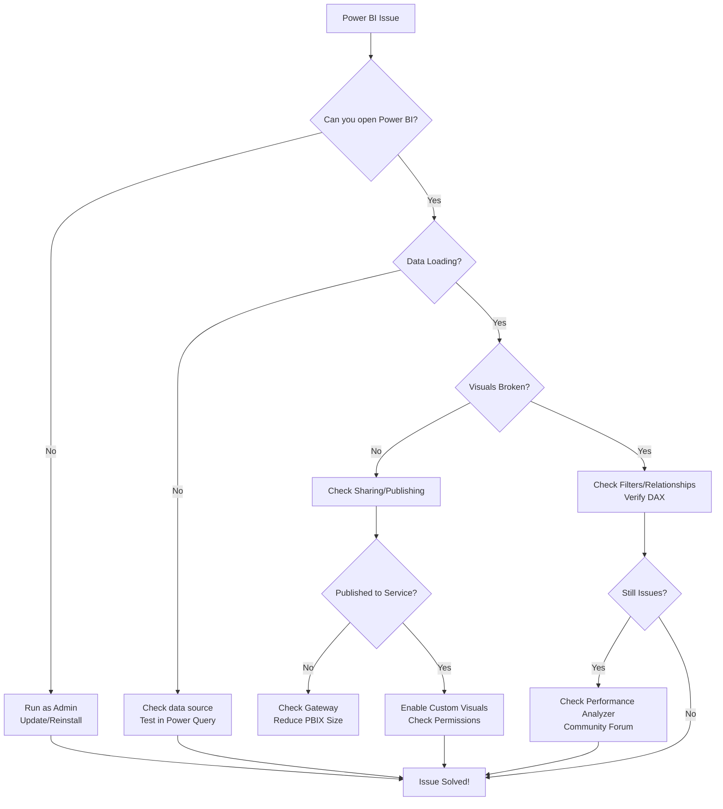

# **Power BI Troubleshooting Guide: Common Issues & Fixes**  

Even the best Power BI users run into problems sometimes. Here’s a **handy troubleshooting guide** to help beginners resolve common issues quickly.  

---

## **🔧 Common Power BI Problems & Solutions**  


    
### **1. Power BI Won’t Open or Crashes**  
❌ **Issue**: Power BI Desktop crashes on startup or freezes.  
✅ **Fix**:  
- **Update Power BI** (Help → Check for Updates)  
- **Run as Administrator** (Right-click → "Run as Administrator")  
- **Reset Settings** (File → Options → "Reset all settings")  
- **Reinstall Power BI** if the issue persists.  

---

### **2. Data Loading Errors**  
❌ **Issue**: "Failed to load data" or "Connection error."  
✅ **Fix**:  
- **Check data source permissions** (Does Power BI have access?)  
- **Test connection in Power Query** (Home → "Data source settings")  
- **Use Import Mode instead of DirectQuery** (If the dataset is too large for DirectQuery)  

---

### **3. Blank Visuals or Missing Data**  
❌ **Issue**: Charts show empty data or incorrect values.  
✅ **Fix**:  
- **Check filters & slicers** (Accidental filtering can hide data)  
- **Verify relationships** (Are tables properly linked in "Model View"?)  
- **Refresh data** (Home → "Refresh")  
- **Check DAX formulas** (A wrong measure can break visuals)  

---

### **4. DAX Formula Errors**  
❌ **Issue**: "The syntax for ‘SUM’ is incorrect" or "Circular dependency detected."  
✅ **Fix**:  
- **Use proper DAX syntax**:  
  - Correct: `Total Sales = SUM(Sales[Amount])`  
  - Wrong: `Total Sales = SUM(Amount)` (Missing table reference)  
- **Avoid circular dependencies** (Measures referencing each other infinitely)  
- **Use ISBLANK()** to handle empty values:  
  ```dax
  Safe Divide = IF(ISBLANK([Denominator]), 0, [Numerator]/[Denominator])
  ```

---

### **5. Slow Performance**  
❌ **Issue**: Reports load slowly or lag.  
✅ **Fix**:  
- **Reduce columns** (Remove unused columns in Power Query)  
- **Disable auto-date tables** (File → Options → "Disable Auto Date/Time")  
- **Use aggregations** (For large datasets, pre-summarize data)  
- **Avoid too many visuals on one page** (Split into multiple pages)  

---

### **6. Publishing Fails to Power BI Service**  
❌ **Issue**: "Publish failed" or "Gateway not found."  
✅ **Fix**:  
- **Sign in with the correct account** (Same as Power BI Service)  
- **Check gateway setup** (If using on-premises data)  
- **Reduce file size** (Compress PBIX or split reports)  

---

### **7. Missing Visuals After Publishing**  
❌ **Issue**: Custom visuals disappear in Power BI Service.  
✅ **Fix**:  
- **Enable custom visuals** (Settings → "Enable custom visuals")  
- **Re-import visuals** (Publish again or check AppSource updates)  

---

### **8. Can’t Share Reports**  
❌ **Issue**: "You don’t have permission to share."  
✅ **Fix**:  
- **Check workspace role** (Need Admin, Member, or Contributor)  
- **Use Power BI Pro license** (Free users can’t share to others)  

---

## **🛠️ Advanced Troubleshooting**  
If basic fixes don’t work, try:  
- **Power BI Desktop logs** (`C:\Users\[User]\Microsoft\Power BI Desktop\Traces`)  
- **Power BI Community Forum** ([community.powerbi.com](https://community.powerbi.com/))  
- **Microsoft Support** (For enterprise-level issues)  

---

## **📌 Pro Tip: Prevent Issues Before They Happen**  
✔ **Save backups** (File → "Save As" frequently)  
✔ **Use Power BI Performance Analyzer** (View → "Performance Analyzer")  
✔ **Test in small steps** (Build one visual at a time)  

---

### **🚀 Still Stuck?**  
Ask in the **Power BI Community** or open a **GitHub Issue** if this guide needs updates!  

